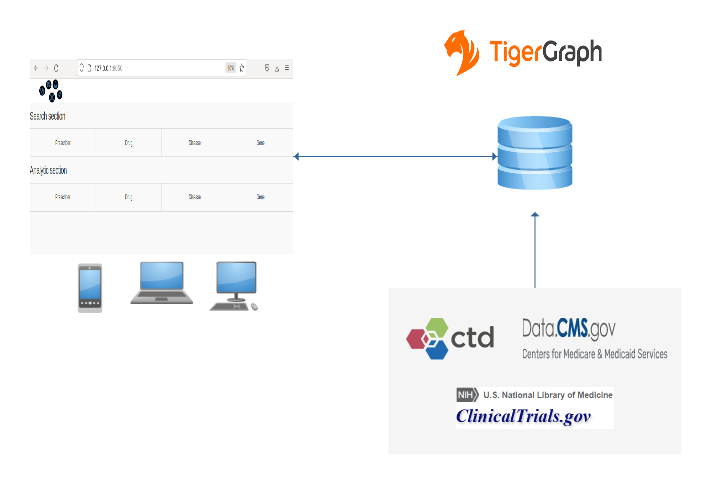

# Drug and Disease Mining and Prediction (DDMP)


## Contributer and Contact Information:
* Contributer: Sofiane Lagraa 
* Contact Information:  sofianelagraa87 [at] gmail.com

## Problem Statement addressed:

## Description:
Explain what your project is trying to accomplish 

### How is the graph technology utilized to achieve those goals?

Describe how your submission is relevant to the problem statement

### Why is it impactful to the world?

### Demo link: https://ddmp-tigergraph.herokuapp.com

### Video demo link: 
 * Short version (< 3minutes): https://youtu.be/lLi82otLFlM
 * Long version (7 minutes): https://youtu.be/sR27uX2hH9c

### How the entry was the most
#### Impactful in solving a real world problem


#### Innovative use case of graph


#### Ambitious and complex graph


#### Applicable graph solution

## Data : 
* Source 1: [ctdbase](http://ctdbase.org/), Comparative Toxicogenomics Database. CTD is a robust, publicly available database that aims to advance understanding about how environmental exposures affect human health. It provides manually curated information about chemical–gene/protein interactions, chemical–disease and gene–disease relationships. These data are integrated with functional and pathway data to aid in development of hypotheses about the mechanisms underlying environmentally influenced diseases.
  * The following dataset is used:
    * Chemical–gene interactions, Chemical–disease associations, Gene–disease associations.
* Source 2: [ClinicalTrials.gov](https://clinicaltrials.gov/), ClinicalTrials.gov is a resource provided by the U.S. National Library of Medicine. ClinicalTrials.gov is a database of privately and publicly funded clinical studies conducted around the world.
  * The following dataset is used:
    * There are different status of a clinical trial: Not yet recruiting, Recruiting, Enrolling by invitation, Active not recruiting, Suspended, Terminated,  Completed,    Withdrawn,  Unknown status.
    * In this project, I filter the data and only focus on Completed clinical trials.
* Source 3: [data.cms.gov](https://data.cms.gov/), Center's for Medicare & Medicaid Services (CMS).
  * The following dataset is used:
    * [Prescribers](https://data.cms.gov/provider-summary-by-type-of-service/medicare-part-d-prescribers/medicare-part-d-prescribers-by-provider), contains information on prescription drugs prescribed by individual physicians and other health care providers. ta range: from 2013 to 2019.
    * [Prescription Drug](https://data.cms.gov/provider-summary-by-type-of-service/medicare-part-d-prescribers/medicare-part-d-prescribers-by-provider-and-drug), provides information on prescription drugs prescribed to Medicare beneficiaries. Data range: from 2013 to 2019.

## Technology Stack: 
### Technology description

DDMP is a client-server database app. 
#### Server
  * The server is based on _tigergraph_ database: the different sources of data are processed and mapped to a graph database.
    * The graph database schema is automatically developed from a **python** code using **pyTigerGraph**.
    * This app is composed of a set of modules:
      * Data processing module used for processing and cleaning the input data: codes/processing_precsciptor_drug.ipynb
      * Graph database module used for creating the graph database using pyTigerGraph, a Python package for connecting to TigerGraph databases (https://github.com/pyTigerGraph/pyTigerGraph): codes/Tg_graph_database_creation.ipynb
      * Graph queries module used for installing a set of GSQL queries including: simple queries for searching patterns: codes/install_search_patterns.ipynb
        * Install a set of GSQL queries from codes/queries folder: containing 30 queries.
      * Graph Data science module for 
        * finding clusters of prescribers, drugs, diseases, and gene. The clustering algorithms uses random walks,  node2vec, KNN algorithms: codes/clustering.ipynb
        * Predicting drugs for a specific disease or diseases for a specific drug using the common neighbors algorithm: Predictions.ipynb.


#### Client       
  * The client is used by the user to interact with the server database mainly through a user interface whereas in a web application. 
    * The user interaction is through a web browser using a **laptop** or **smartphone**. 
    * The client is developed in **python** using **dash**. 
    * **Dash** is a python framework created by **plotly** for creating interactive web applications.




### Programming languages used.
* Python3
* GSQL: Graph Query Language | TigerGraph

## Visuals:


The following figure shows the whole graph schema composed of the whole nodes and their links.


# Dependencies

Dependencies and their versions needed to be installed to test this project.

* Python 3==3.6.9

* pyTigerDriver==1.0.14
* pyTigerGraph==0.0.9.9.2
* dash==2.3.1
* dash-bootstrap-components==1.0.3
* dash-core-components==2.0.0
* dash-html-components==2.0.0
* dash-table==5.0.0

* jupyter_client: 7.1.2
* jupyter_core: 4.9.1

* tigergraph On-premise: 3.5.0


# Installation and How to run this app

 

I suggest you to create a virtual environment for running this app with Python 3. Clone this repository 
and open your terminal/command prompt in the root folder.


In Unix system:
```
python3 -m venv ~/.virtualenvs/ddmp
source ~/.virtualenvs/ddmp/bin/activate
```
Clone the repository 
```
git clone https://github.com/sofi007/tigergraph_challenge/
```

Install dependencies
```
cd tigergraph_challenge
pip3 install --upgrade pip
pip3 install -r requirements.txt

```

Run the application
```
python3 ./app.py
```

Test the application by searching the following drugs, diseases, gene, and doctor:
* drug: CYTOFLAVIN, LIDOCAINE, TRAZODONE, VITAMIN_A
* disease: BRAIN_ISCHEMIA, COVID-19, CROHN_DISEASE
* gene: 1052, 11214, 55137, 200734
* doctor (prescriber): 1003053950

# Known Issues and Future Improvements
##  Known limitations within the project
* For the current version, due to the deployment constraints on heroku for testing the demo and testing, there is no connection between the client app (dashboard) and the graph database server for searching queries. In addition, searching patterns in a large graph in a sigle machine takes several seconds which is not good in the production level when the user navigates in the Client app (see the improvement in the next steps section).
* The queries are manually run using GSQL queries (server/codes folder).
* In addiction, the prediction of drugs/diseases as well as the clustering of doctors/drugs/diseases/genes are also running on server side and the results are used the client app. The prediction and clustering take a long time. This is the reason to run prediction and clustering algorithms offline.

## Next steps
* Connect the Client app with the graph database on a dedicated deployment server.
* Create indexes in the graph database to reduce the search time. 
* Create an app for automatically running the prediction and clustering algorithms.
* Include other nodes related to clinical trials in the prediction and clustering algorithms such as biological nodes, devices nodes, genetic nodes,...etc.


# Reflections

Review the steps you took to create this project and the resources you were provided. Feel free to indiciate room for improvement and general reflections.

# References
Here are the list of inspired resources:
* Research papers:
  * Hakime Öztürk, Arzucan Özgür, Philippe Schwaller, Teodoro Laino, Elif Ozkirimli,
  Exploring chemical space using natural language processing methodologies for drug discovery,
  Drug Discovery Today, Volume 25, Issue 4, 2020, Pages 689-705,   ISSN 1359-6446,
  https://doi.org/10.1016/j.drudis.2020.01.020.  (https://www.sciencedirect.com/science/article/pii/S1359644620300465)
  * José Jiménez-Luna, Francesca Grisoni, Nils Weskamp & Gisbert Schneider (2021) Artificial intelligence in drug discovery: recent advances and future perspectives, Expert Opinion on Drug Discovery, 16:9, 949-959, DOI: 10.1080/17460441.2021.1909567
  * Gershell, L., Atkins, J. A brief history of novel drug discovery technologies. Nat Rev Drug Discov 2, 321–327 (2003). https://doi.org/10.1038/nrd1064
  


