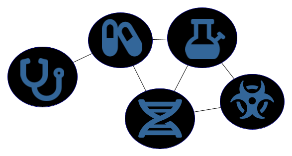
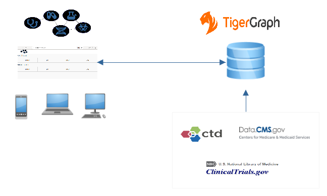
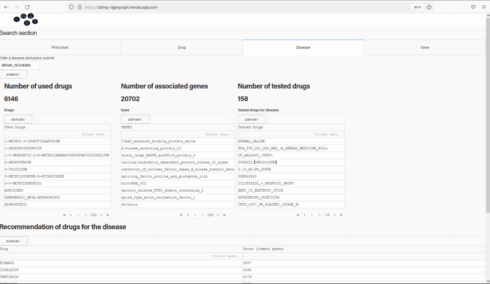
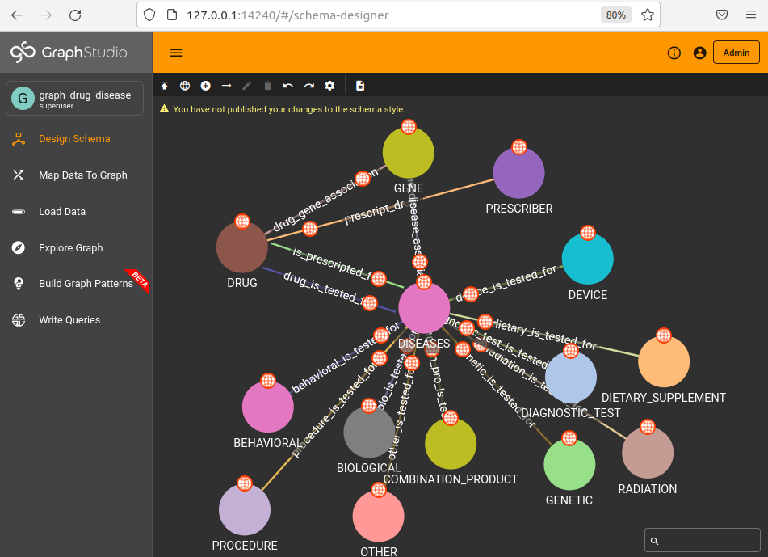

# Drug and Disease Mining and Prediction (DDMP)


## Contributer and Contact Information:
* Contributer: Sofiane Lagraa 
* Contact Information:  sofianelagraa87 [at] gmail.com

## Problem Statement addressed:

## Description:
Explain what your project is trying to accomplish 

### How is the graph technology utilized to achieve those goals?

Describe how your submission is relevant to the problem statement

### Why is it impactful to the world?

### Demo link: https://ddmp-tigergraph.herokuapp.com

### Video demo link: 
 * Short version (< 3minutes): https://youtu.be/lLi82otLFlM
 * Long version (7 minutes): https://youtu.be/sR27uX2hH9c

### How the entry was the most
#### Impactful in solving a real world problem
According to an of-cited Tufts Center for the Study of Drug Development (CSDD) study, the average cost to develop a new drug is roughly $2.6 billion. Additionally, 90% of new drugs fail to win approval. For those few that do manage to win approval, it still takes at least 10 years to get them to market [1].
My solution helps the doctors and researchers. 9.2 million doctors worldwide in 2010 [2]. As of 2018, there were over 985,000 practicing physicians in the United States. 14,000 physician-scientists in the United States [3].
* Economic benefits:
     * Reduce the cost of research and development of new drugs
     * Reduce the new drugs approval failure and the time-to-market
* Social benefits:
     * Creating connections between doctors prescribing the same drug. It allows to create a collaborative practice between doctors and pharmacists which has a positive effect on healthcare outcomes. According to [4], 98% of doctors and pharmacists agreed that doctor-pharmacist collaboration improves patient outcomes, more than half of the physicians (52.1%) and pharmacists (55.7%) had never practiced collaboratively.
    * Helping researchers by identifying doctors prescribing a drug. 

[1] Mullard, A. New drugs cost US$2.6 billion to develop. Nature Reviews Drug Discovery (2014).
[2] Nigel Crisp, M.A., and Lincoln Chen, M.D. Global Supply of Health Professionals. New England Journal of Medicine. 2014.
[3] Physician-Scientist Workforce (PSW) Report 2014. NIH. 
[4] Albassam A, et al.. Perspectives of primary care physicians and pharmacists on interprofessional collaboration in Kuwait: A quantitative study. PLoS One. 2020;15(7)


#### Innovative use case of graph
The project offers a novel use of graph as a search engine and a recommendation system for prescribers (doctors), drugs, diseases, genes, and clinical trials.
Healthcare data are naturally high-dimensional and sparse because most medical concepts are not applicable to most individuals. For example, any individual doctor prescribes a small subset of drugs. My project seeks to provide effective representations between prescribes, drugs, diseases, and genes, as well as clinical trials by producing useful clusters of high-dimensional sparse data. 
Healthcare data are large and unstructured data. In fact, the big problem of healthcare fields is that about 80% of medical data remains unstructured. Unstructured data is an information that is not arranged according to a pre-set data model or schema. It faces complex data storage and management issues.
In the existing research works, not all the prescribers, drugs, diseases, genes, and clinical trials data are jointly used in the same database.
For all these reasons, the use of a graph database:
* offers an agile and flexible structures, 
* represents relationships of Healthcare data in one homogeneous database.
* highlights relationships between prescribers and drugs, drugs and diseases, drugs and genes, diseases and genes as well as the integration of clinical trials.
* Queries output real-time results


[1] Kong HJ. Managing Unstructured Big Data in Healthcare System. Healthc Inform Res. 2019;25(1):1-2. doi:10.4258/hir.2019.25.1.1

#### Ambitious and complex graph
The graph-based solution allows to:
*	Reduce the size of the initial heterogeneous data (initially 20,3 GB) by creating connections (relationships), it reduces the redundant data in the database.
*	Manage a big data infrastructure.
*	develop patterns for finding new drugs or recommend to test drug in another disease. This kind of complex patterns cannot be developed in a classical database.

Graph database schema:
The design schema and the map of the data to the graph database is performed in python code.
The graph schema is composed of the following principal nodes: PRESCRIBER, DRUG, DISEASE, GENE, BEHAVIORAL, BIOLOGICAL, COMBINATION_PRODUCT, DEVICE, DIAGNOSTIC_TEST, DIETARY_SUPPLEMENT, GENETIC, OTHER, PROCEDURE, RADIATION. 
The graph is composed of the following principal links between the nodes:
*	prescript_drug: a link between prescriber and drug nodes. A link is created when a prescriber prescribe a drug.
*	is_prescripted_for: a link between a drug and disease. A link is created from a list of drugs used for diseases.
*	drug_is_tested_for: a link between a drug and tested disease in the clinical trials. A link is created from a list of drugs used for diseases in the clinical trials.
*	gene_disease_association: a link between a gene and disease. A link is created from a list of genes associated to diseases.
*	drug_gene_association: a link between a gene and disease. A link is created from a list of genes associated to drugs.


The graph schema size
*	Vertex count: 2,288,301, Edge count: 153,259,948

30 GSQL queries has been developed. 
The solution can work on a laptop or a mobile application.

#### Applicable graph solution
The current version is considered as a Proof of Concept (POC) version but ready enough to try it on a real-world case. Other visualization-related performance enhancements can be made in order to easily deploy it at the production-level. 
My solution could be adopted by the pharmaceutical industry. In fact, the global pharmaceutical manufacturing market size was estimated at USD 405.52 billion in 2020 [1]. Especially, the research and development of the pharmaceutical industry. In 2020, research and development spending in the pharmaceutical industry totaled nearly 200 billion U.S. dollars globally. For comparison, R&D expenditures totaled 137 billion dollars in 2012 [2].

[1] Pharmaceutical Manufacturing Market Size, Share & Trends Analysis Report By Molecule Type, By Drug Development Type, By Formulation, By Routes of Administration, By Sales Channel, By Age Group, And Segment Forecasts, 2021 – 2028. https://www.grandviewresearch.com/industry-analysis/pharmaceutical-manufacturing-market
[2] https://www.statista.com/statistics/309466/global-r-and-d-expenditure-for-pharmaceuticals/

## Data : 
* Source 1: [ctdbase](http://ctdbase.org/), Comparative Toxicogenomics Database. CTD is a robust, publicly available database that aims to advance understanding about how environmental exposures affect human health. It provides manually curated information about chemical–gene/protein interactions, chemical–disease and gene–disease relationships. These data are integrated with functional and pathway data to aid in development of hypotheses about the mechanisms underlying environmentally influenced diseases.
  * The following dataset is used:
    * Chemical–gene interactions, Chemical–disease associations, Gene–disease associations.
* Source 2: [ClinicalTrials.gov](https://clinicaltrials.gov/), ClinicalTrials.gov is a resource provided by the U.S. National Library of Medicine. ClinicalTrials.gov is a database of privately and publicly funded clinical studies conducted around the world.
  * The following dataset is used:
    * There are different status of a clinical trial: Not yet recruiting, Recruiting, Enrolling by invitation, Active not recruiting, Suspended, Terminated,  Completed,    Withdrawn,  Unknown status.
    * In this project, I filter the data and only focus on Completed clinical trials.
* Source 3: [data.cms.gov](https://data.cms.gov/), Center's for Medicare & Medicaid Services (CMS).
  * The following dataset is used:
    * [Prescribers](https://data.cms.gov/provider-summary-by-type-of-service/medicare-part-d-prescribers/medicare-part-d-prescribers-by-provider), contains information on prescription drugs prescribed by individual physicians and other health care providers. ta range: from 2013 to 2019.
    * [Prescription Drug](https://data.cms.gov/provider-summary-by-type-of-service/medicare-part-d-prescribers/medicare-part-d-prescribers-by-provider-and-drug), provides information on prescription drugs prescribed to Medicare beneficiaries. Data range: from 2013 to 2019.

* **All the data is processed and published in the link due the large size**: https://drive.google.com/drive/folders/1RZo1oD2CBOKVJYPIHMFtIUvd7vXzxvhN?usp=sharing

## Technology Stack: 
### Technology description

DDMP is a client-server database app. 
#### Server
  * The server is based on _tigergraph_ database: the different sources of data are processed and mapped to a graph database.
    * The graph database schema is automatically developed from a **python** code using **pyTigerGraph**.
    * This app is composed of a set of modules:
      * Data processing module used for processing and cleaning the input data: codes/processing_precsciptor_drug.ipynb
      * Graph database module used for creating the graph database using pyTigerGraph, a Python package for connecting to TigerGraph databases (https://github.com/pyTigerGraph/pyTigerGraph): codes/Tg_graph_database_creation.ipynb
      * Graph queries module used for installing a set of GSQL queries including: simple queries for searching patterns: codes/install_search_patterns.ipynb
        * Install a set of GSQL queries from codes/queries folder: containing 30 queries.
      * Graph Data science module for 
        * finding clusters of prescribers, drugs, diseases, and gene. The clustering algorithms uses random walks,  node2vec, KNN algorithms: codes/clustering.ipynb
        * Predicting drugs for a specific disease or diseases for a specific drug using the common neighbors algorithm: Predictions.ipynb.


#### Client       
  * The client is used by the user to interact with the server database mainly through a user interface whereas in a web application. 
    * The user interaction is through a web browser using a **laptop** or **smartphone**. 
    * The client is developed in **python** using **dash**. 
    * **Dash** is a python framework created by **plotly** for creating interactive web applications.




### Programming languages used.
* Python3
* GSQL: Graph Query Language | TigerGraph

## Visuals:




The following figure shows the whole graph schema composed of the whole nodes and their links.




# Dependencies

Dependencies and their versions needed to be installed to test this project.

* Python 3==3.6.9

* pyTigerDriver==1.0.14
* pyTigerGraph==0.0.9.9.2
* dash==2.3.1
* dash-bootstrap-components==1.0.3
* dash-core-components==2.0.0
* dash-html-components==2.0.0
* dash-table==5.0.0

* jupyter_client: 7.1.2
* jupyter_core: 4.9.1

* tigergraph On-premise: 3.5.0


# Installation and How to run this app

 

I suggest you to create a virtual environment for running this app with Python 3. Clone this repository 
and open your terminal/command prompt in the root folder.


**In Unix system**:
```
python3 -m venv ~/.virtualenvs/ddmp
source ~/.virtualenvs/ddmp/bin/activate
```
Clone the repository 
```
git clone https://github.com/sofi007/tigergraph_challenge/
```

Install dependencies
```
cd tigergraph_challenge
pip3 install --upgrade pip
pip3 install -r requirements.txt

```

Run the application
```
python3 ./app.py
```

Test the application by searching the following drugs, diseases, gene, and doctor:
* drug: TRAZODONE, VITAMIN_A, LIDOCAINE, CYTOFLAVIN
* disease: COVID-19, BRAIN_ISCHEMIA, CROHN_DISEASE
* gene: 1052, 11214, 55137, 200734
* doctor (prescriber): 1003053950

**In Windows system**:
```
# py -m venv /path/to/new/virtual/environment
py -m venv ddmp
Script\activate
```
Clone the repository 
```
git clone https://github.com/sofi007/tigergraph_challenge/
```

Install dependencies
```
cd tigergraph_challenge
pip3 install --upgrade pip
pip3 install -r requirements.txt

```

Run the application
```
py ./app.py
```
Test the application by searching the following drugs, diseases, gene, and doctor:
* drug: TRAZODONE, VITAMIN_A, LIDOCAINE, CYTOFLAVIN
* disease: COVID-19, BRAIN_ISCHEMIA, CROHN_DISEASE
* gene: 1052, 11214, 55137, 200734
* doctor (prescriber): 1003053950

# Known Issues and Future Improvements
##  Known limitations within the project
* I used tigergraph on-premise because I have a high memory size (62 GB) and a large number of CPUs (32) compared to the tigergraph cloud with 8 GB and 4 CPUs. Thus, running graph machine learning algorithms such as random walk, and node2vec consume a large memory and disk usages making the purpose of the project impossible in tigergraph cloud.
* For the current version, due to the deployment constraints for testing the demo and testing due the use of tigergraph on-premise instead of tigergraph cloud, there is no connection between the client app (dashboard) and the graph database server for searching queries. 
* The graph database is big. Searching patterns in a large graph in a sigle machine takes several seconds which is not good in the production level when the user navigates in the Client app (see the improvement in the next steps section).
* The queries are manually run using GSQL queries (server/codes folder) and the results are put in the client side.
* In addiction, the prediction of drugs/diseases as well as the clustering of doctors/drugs/diseases/genes are also running on server side and the results are used the client app. The prediction and clustering take a long time. This is the reason to run prediction and clustering algorithms offline.

## Next steps
* Connect the Client app with the graph database on a dedicated deployment server.
* Create indexes in the graph database to reduce the search time. 
* Create an app for automatically running the prediction and clustering algorithms.
* Include other nodes related to clinical trials in the prediction and clustering algorithms such as biological nodes, devices nodes, genetic nodes,...etc.


# Reflections

Review the steps you took to create this project and the resources you were provided. Feel free to indiciate room for improvement and general reflections.

The project is build based on the availabilities of the data, and how can I create relationships between them into a graph database, and how can I visualize the results such as every user can easily use it. First: the data was collected and processed from different heterogeneous sources. The processing step consists in cleaning the data by removing special characters, performing a data harmonization from different sources and provide a comparable view of data from different studies. In parallel, I read different research and business papers and reports in order to have a good idea about the expectations. Second, the graph schema and data mapping are automatically performed in the python code using the tigergraph api. Third, 30 GSQL queries were created and installed in the graph database. Finally, a dashboard was developed using the framework dash-plotly. The dashboard is a web-app containing a search engine, analytical results, and a recommendation system. The web-app can be used in a laptop or a mobile. 
Different improvements could be done in the following domains: 
* Research and Development: More research in NLP (Natural Language Processing) could be done for processing textual data related to drug, diseases. Another direction is to include and combine biological data with textual data and knowledge experts.  
* Business: by including professional persons in order to study and investigate the market and providing a business view.


# References
Here are the list of inspired resources:
* Research papers:
  * Hakime Öztürk, Arzucan Özgür, Philippe Schwaller, Teodoro Laino, Elif Ozkirimli, Exploring chemical space using natural language processing methodologies for drug discovery, Drug Discovery Today, Volume 25, Issue 4, 2020, Pages 689-705,   ISSN 1359-6446, https://doi.org/10.1016/j.drudis.2020.01.020
  * Kong HJ. Managing Unstructured Big Data in Healthcare System. Healthc Inform Res. 2019;25(1):1-2. doi:10.4258/hir.2019.25.1.1
  * José Jiménez-Luna, Francesca Grisoni, Nils Weskamp & Gisbert Schneider (2021) Artificial intelligence in drug discovery: recent advances and future perspectives, Expert Opinion on Drug Discovery, 16:9, 949-959, DOI: 10.1080/17460441.2021.1909567
  * Gershell, L., Atkins, J. A brief history of novel drug discovery technologies. Nat Rev Drug Discov 2, 321–327 (2003). https://doi.org/10.1038/nrd1064

* Bussiness papers/reports:
 * Mullard, A. New drugs cost US$2.6 billion to develop. Nature Reviews Drug Discovery (2014).
 * Fleming, Nic. How artificial intelligence is changing drug discovery. Nature (2018).
 * Smalley, E. AI-powered drug discovery captures pharma interest. Nature Biotechnology (2017).
 * M. Hutson, Artificial intelligence faces reproducibility crisis, Science 359 (6377) (2018) 725–726.
 * Nigel Crisp, M.A., and Lincoln Chen, M.D. Global Supply of Health Professionals. New England Journal of Medicine. 2014.
 * Physician-Scientist Workforce (PSW) Report 2014. NIH. https://report.nih.gov/workforce/psw/med_degree.aspx
 * Pharmaceutical Manufacturing Market Size, Share & Trends Analysis Report By Molecule Type, By Drug Development Type, By Formulation, By Routes of Administration, By Sales Channel, By Age Group, And Segment Forecasts, 2021 – 2028. https://www.grandviewresearch.com/industry-analysis/pharmaceutical-manufacturing-market
 * https://www.statista.com/statistics/309466/global-r-and-d-expenditure-for-pharmaceuticals/

 
  


