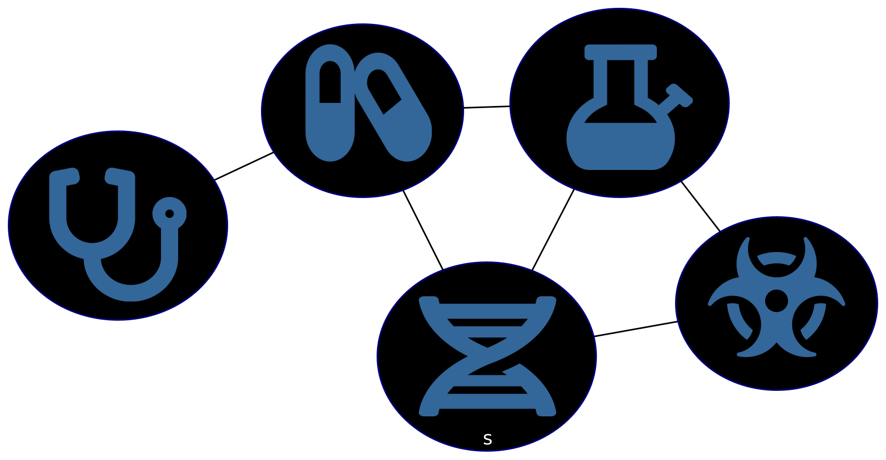
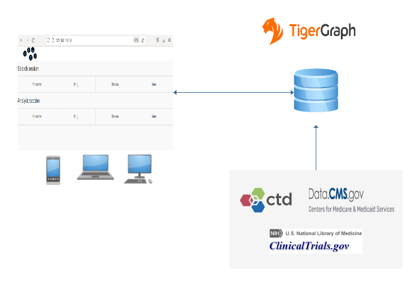

# Drug and Disease Mining and Prediction application (DDMP)


DDMP is a client-server database app. 
  * The server is based on _tigergraph_ database. 
  * The client is used by user to interaction with the server database mainly through a user interface whereas in a web application the user interaction is through a web browser using a laptop or smartphone. The client is developed in python using dash. Dash is a python framework created by plotly for creating interactive web applications.





## Data source:
* Source 1: [ctdbase](http://ctdbase.org/), Comparative Toxicogenomics Database. CTD is a robust, publicly available database that aims to advance understanding about how environmental exposures affect human health. It provides manually curated information about chemical–gene/protein interactions, chemical–disease and gene–disease relationships. These data are integrated with functional and pathway data to aid in development of hypotheses about the mechanisms underlying environmentally influenced diseases.
  * The following dataset is used:
    * Chemical–gene interactions, Chemical–disease associations, Gene–disease associations.
* Source 2: [ClinicalTrials.gov](https://clinicaltrials.gov/), ClinicalTrials.gov is a resource provided by the U.S. National Library of Medicine. ClinicalTrials.gov is a database of privately and publicly funded clinical studies conducted around the world.
  * The following dataset is used:
    * There are different status of a clinical trial: Not yet recruiting, Recruiting, Enrolling by invitation, Active not recruiting, Suspended, Terminated,  Completed,    Withdrawn,  Unknown status.
    * In this project, I filter the data and only focus on Completed clinical trials.
* Source 3: [data.cms.gov](https://data.cms.gov/), Center's for Medicare & Medicaid Services (CMS).
  * The following dataset is used:
    * [Prescribers](https://data.cms.gov/provider-summary-by-type-of-service/medicare-part-d-prescribers/medicare-part-d-prescribers-by-provider), contains information on prescription drugs prescribed by individual physicians and other health care providers. ta range: from 2013 to 2019.
    * [Prescription Drug](https://data.cms.gov/provider-summary-by-type-of-service/medicare-part-d-prescribers/medicare-part-d-prescribers-by-provider-and-drug), provides information on prescription drugs prescribed to Medicare beneficiaries. Data range: from 2013 to 2019.
    
charatristcs
link 2


## Graph database schema

Design schema and the map of the data to graph is performed in python code in server part.

Graph schema: The graph schema is composed of the following principal nodes: 
* *PRESCRIBER* the node represents the prescriber and has the following parameters: NPI, Last Name, First Name,Prscrbr_MI ,Prscrbr_Crdntls, Gender, City, State, Zipcode
* *DRUG*: the node represents the drug and has the following parameter: drug name. 
* *DISEASE*: the node represents the disease and  has the following parameter: disease Name.
* *GENE*: the node represents the gene and has the following parameters: GeneID, GeneSymbol, GeneName, AltGeneIDs, Synonyms, BioGRIDIDs, PharmGKBIDs, UniProtIDs
* *BEHAVIORAL*: the node represents the behavioral procedure used in the clinical trials and has the following parameter: behavioral name. 
* *BIOLOGICAL*: the node represents the biological method procedure used in the clinical trials and has the following parameter: biological name.
* *COMBINATION_PRODUCT*: the node represents the combination of products used in the clinical trials and has the following parameter: nane of combination of products.
* *DEVICE*: the node represents the device method used in the clinical trials and has the following parameter: device name.
* *DIAGNOSTIC_TEST*: the node represents the diagnostic test method used in the clinical trials and has the following parameter: diagnostic test name.
* *DIETARY_SUPPLEMENT*: the node represents the dietary supplement method used in the clinical trials and has the following parameter: dietary supplement name.
* *GENETIC*: the node represents the genetic method used in the clinical trials and has the following parameter: genetic name.
* *OTHER*: the node represents the other method used in the clinical trials and has the following parameter: other name.
* *PROCEDURE*: the node represents the procedure  used in the clinical trials and has the following parameter: procedure name.
* *RADIATION*: the node represents the radiation method used in the clinical trials and has the following parameter: radiation name.

The graph is composed of the following links between the nodes: 
* *prescript_drug*: a link between prescriber and drug nodes. A link is created when a prescriber prescribe a drug. 
* *is_prescripted_for*: a link between a drug and disease. A link is created from a list of drugs used for diseases.
* *drug_is_tested_for*: a link between a drug and tested disease in the clinical trials. A link is created from a list of drugs used for diseases in the clinical trials.
* *gene_disease_association*: a link between a gene and disease. A link is created from a list of genes associated to diseases.
* *drug_gene_association*: a link between a gene and disease. A link is created from a list of genes associated to drugs.

The following figure shows a reduced graph schema composed of the principal nodes and their links: PRESCRIBER, DRUG, DISEASE, GENE.


The following figure shows a reduced graph schema composed of the whole nodes and their links.


Using *gstatusgraph*  command here is the characteristics of the graph in tigergraph database
```

=== graph ===
[GRAPH  ] Graph was loaded (/home/tigergraph/tigergraph/data/gstore):
[m1     ] Partition size: 586MiB, IDS size: 121MiB, Vertex count: 2288301, Edge count: 153259948, NumOfDeletedVertices: 0 NumOfSkippedVertices: 0
```

